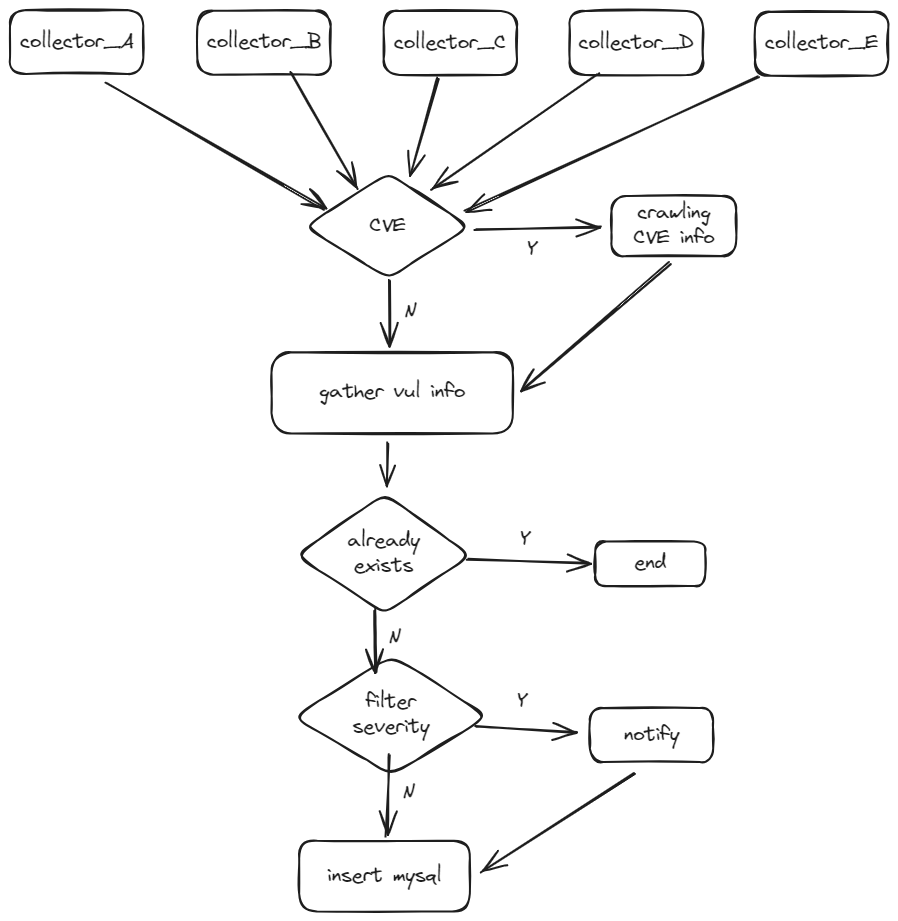
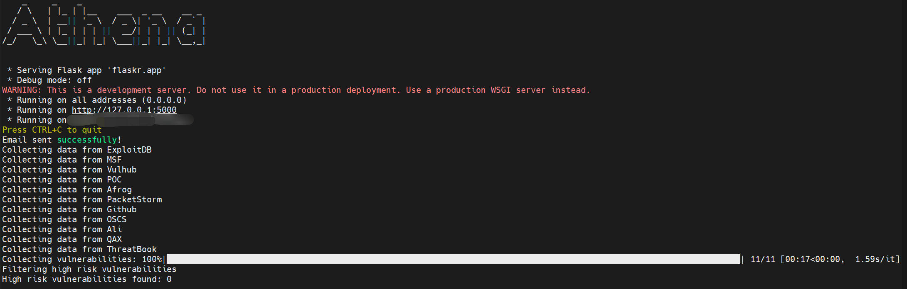
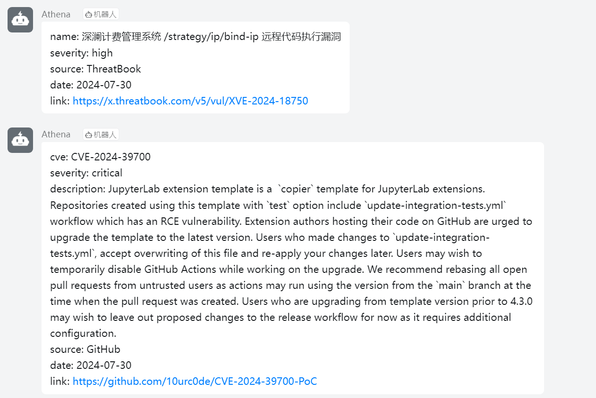
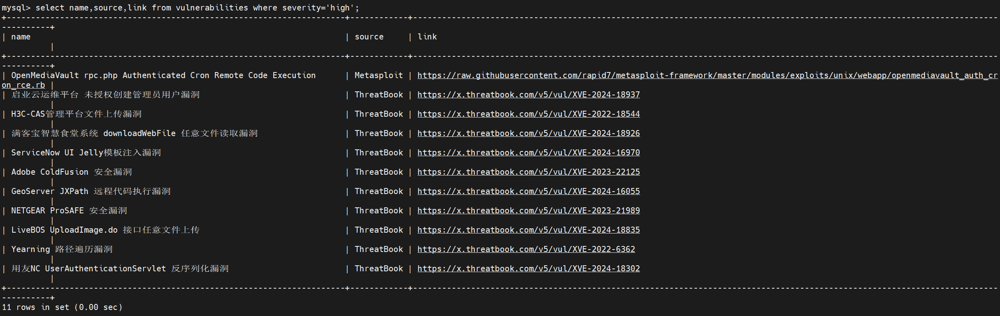
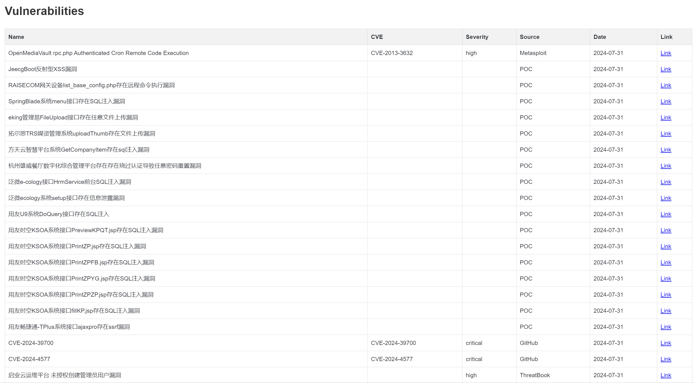
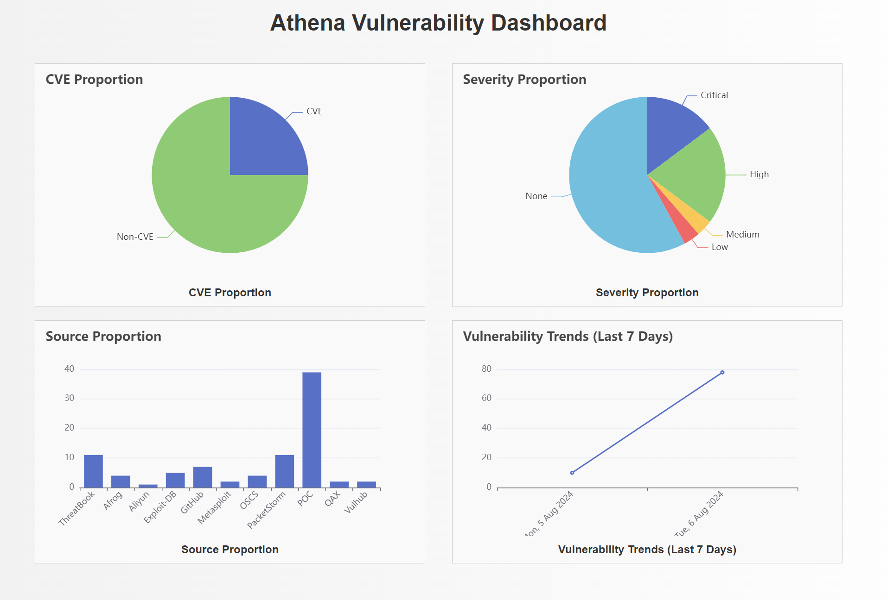
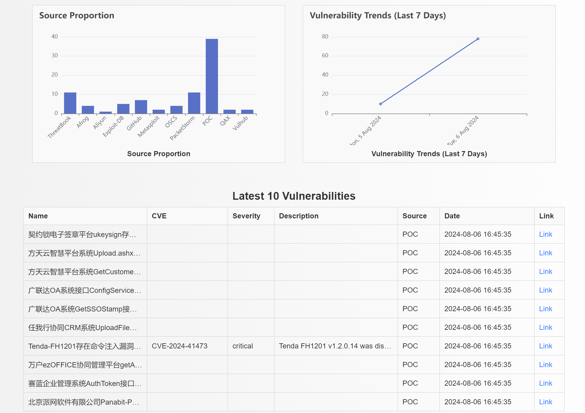
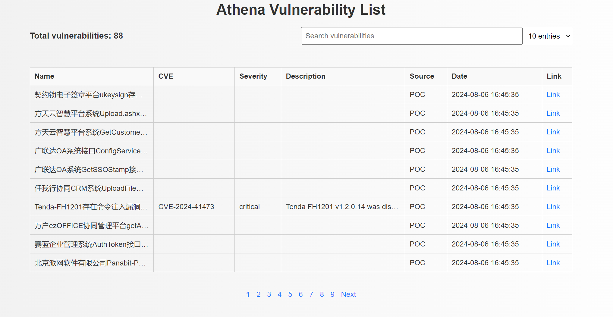
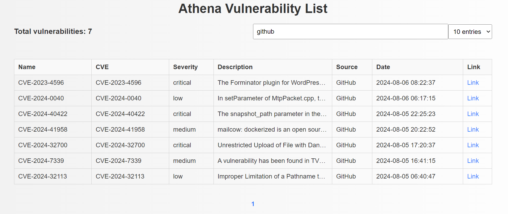
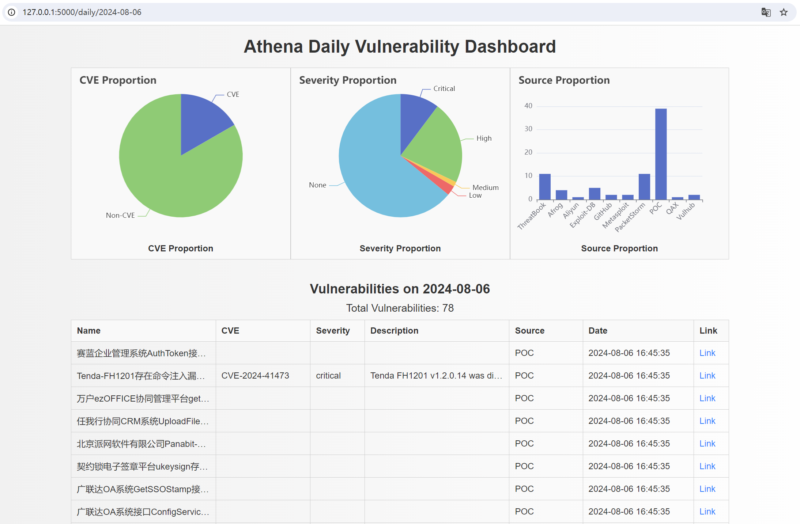

<h4 align="center">Athena旨在从多个漏洞源和厂商通告中聚合漏洞信息，并实现实时推送以增强安全监控和响应能力</h4>
<p align="center">
    <a href="https://www.python.org/downloads/release/python-387/">
        
    </a>
	<a href="https://github.com/leesinz/Athena/stargazers">
        
    </a>
    <a href="https://github.com/leesinz/Athena/watchers">
        
    </a>
    <a href="https://github.com/leesinz/Athena/network/members">
        
    </a>


## WHAT

在古希腊神话中，雅典娜（**Athena**）是智慧与战争的女神，守护着人类的知识与安全。受此启发，此项目 **Athena** 旨在守护现代网络世界的安全。

**Athena** 是一个用于监控各个漏洞源和安全厂商的漏洞通告，并进行实时推送的Python项目，希望帮助安全团队及时获取高风险漏洞信息，提供快速响应能力。

**Athena**会聚合所有漏洞源漏洞信息，存入数据库，并筛选出高危漏洞进行实时推送，推送渠道支持钉钉机器人、企微机器人等等。

### 已覆盖漏洞源

- [x] afrog
- [x] exploit-db
- [x] github
- [x] metasploit
- [x] packetstormsecurity
- [x] POC
- [x] seebug
- [x] vulhub
- [x] 微步漏洞情报
- [x] 阿里云高危漏洞库
- [x] OSCS漏洞情报库
- [x] 奇安信漏洞通告


### ~~TODO~~ DONE

- [x] 每日所有漏洞信息邮件推送  ~~（模板doing，V2.0实现）~~
- [x] flask+datatables+echarts实现完整前后端  ~~（V2.0实现）~~


## WHY

目前已有不少用于漏洞监控的优秀开源项目，但是存在监控源较少、对数据的处理粒度较大、可视化效果较差等问题，导致漏洞数据从收集、聚合、展示到推送的整个过程略显繁琐，**Athena**希望能够解决这些问题，用最简单的配置即可实现最全面的功能。

## HOW

### 环境

**python 3.8+**

```bash
sudo apt-get update
sudo apt-get install python3.8 python3.8-venv python3.8-dev
```

**mysql**

```bash
sudo apt-get update
sudo apt-get install mysql-server
sudo mysql_secure_installation
```

设置密码并创建数据库，将配置信息同步到config.yaml。

如果遇到

`Error connecting mysql database:%!(EXTRA *mysql.MySQLError=Error 1698 (28000): Access denied for user 'root'@'localhost', string=)`

重置密码即可：

`ALTER USER 'root'@'localhost' IDENTIFIED WITH mysql_native_password BY 'newpasswd';`

### 安装

```
git clone xxx
pip install -r requirements.txt
```

### 配置

config.yaml

```yaml
global:
  max_retries: 3
  delay: 3
  timeout: 30

#https://github.com/settings/tokens
github:
  token: ""

#collectors默认为空，表示爬取所有漏洞源信息，如需指定特定源，可修改此项.可选项为['POC','Afrog','PacketStorm','Github','Seebug','OSCS','Ali','QAX','ThreatBook','Vulhub','MSF','ExploitDB']
collectors: []

#指定需要实时推送的漏洞等级，默认全部推送，如果只想推送高危和严重漏洞，置为["high", "critical"]即可
severity_filter: ["", "low", "medium", "high", "critical"]

#数据库配置
mysql:
  host: 127.0.0.1
  port: 3306
  database: ""
  username: ""
  password: ""

#实时推送选项，如需开启，则将enable置为true，并配置相关token
notify:
  #https://developer.work.weixin.qq.com/document/path/91770
  wxwork:
    enable: false
    key:

  #https://open.dingtalk.com/document/robots/custom-robot-access
  dingtalk:
    enable: false
    access_token:
    secret:

  #https://open.feishu.cn/document/client-docs/bot-v3/add-custom-bot#9fe10f9b
  feishu:
    enable: false
    webhook:
    secret:

  #邮箱配置，在每天6点会推送前一天的漏洞汇总，注意password为授权码
  email:
    smtp_server:
    smtp_port:
    username:
    password:
    from:
    to:
      -
      -

```

### 运行逻辑



### 快速开始

若无法在本地搭建项目，可直接加入下方钉钉通知群组：


seebug监控默认关闭，由于使用的是chrome.driver无头浏览器的方式，可能产生内存问题，最终导致程序中断，如果需要，去掉collectors/manager.py中self.collector_classes的注释即可：

```python
self.collector_classes = {
    'ExploitDB': ExploitDBCollector,
    'MSF': MSFCollector,
    'Vulhub': VulhubCollector,
    'POC': POCCollector,
    'Afrog': AfrogCollector,
    'PacketStorm': PacketStormCollector,
    # chrome.driver starts frequently, which may cause memory issues and eventually lead to code termination
    # 'Seebug': SeebugCollector,
    'Github': GitHubCollector,
    'OSCS': OSCSCollector,
    'Ali': AliCollector,
    'QAX': QAXCollector,
    'ThreatBook': ThreatBookCollector
        }
```

默认10分钟运行一次，如需更改，修改main.py即可：

```python
while True:
    vulnerabilities = gather_data()
    filter_high_risk_vuls(vulnerabilities)
    time.sleep(600)
```

安装完需要的库，配置好config.yaml后，即可开始运行。



注意，需要一直在后台保持运行，可配合screen等工具实现。

#### 实时漏洞预警

**注意：** 默认推送所有severity漏洞，如需更改请修改config.yaml中的severity_filter。

推送内容如下：



#### 数据库信息

所有漏洞均会存入数据库：



#### 每日漏洞汇总

每天六点会推送前一天的漏洞汇总，邮件内容如下：



由于漏洞描述可能较长，影响观感，因此邮件中隐藏了描述字段，每个漏洞均可通过点击link跳转至poc或详情页。

#### 数据可视化

在V2.0中，实现了数据的可视化，默认端口为5000。

**重要！！！**  在该项目中，后端由flask实现，在main.py中，通过run_flask_app来运行应用：

```python
def run_flask_app():
    app.run(debug=False)
```

默认配置下，仅能本机访问，即`host = '127.0.0.1'`，若想进行远程访问，有如下几种方法：

- 推荐通过nps等隧道工具实现，较为安全，但是需要配置隧道工具
- 修改`app.run(debug=False)`为`app.run(debug=False,host='0.0.0.0')`，修改后直接对所有主机开放，简单粗暴，但是存在一定安全风险，如有意外作者概不负责！
- 保持host为127.0.0.1，自定义路由


在此提供一种通过putty搭建隧道在本地访问的方式：[ssh隧道](https://github.com/leesinz/Athena/blob/main/putty.md)


前端展示共有3处路由：首页('/'或'/index')，漏洞总览('/vuls')和每日漏洞详情('/daily/[date]')

#### /index

首页有两部分，第一部分是漏洞的统计结果，有四张图表，分别统计了所有漏洞中，CVE的占比，各种severity漏洞的占比，各漏洞源漏洞的占比以及近7天来的漏洞数量变化趋势。



第二部分为最新的十条漏洞数据：



为了更加美观，在图表中没有采取换行的方式，如有超长字段，会隐藏一部分，鼠标悬停即可查看完整内容。

同样，单击右侧link即可跳转至漏洞POC或详情页。

#### /vuls

该路由展示了全量的漏洞数据，并且添加了搜索功能：



右上方可选每页展示的漏洞条数，通过最下方页码即可跳转。

搜索框中为模糊搜索，支持全字段，例如搜索name，cve，source，severity，date等等：



#### /daily/date

通过输入%Y-%m-%d形式的日期，可查询指定日期的漏洞情况，以2024-08-06为例：

`/daily/2024-08-06`



展示了当前日期CVE漏洞占比，各severity和source的漏洞占比，以及当天更新的所有漏洞信息。

### 扩展

如需扩展其他漏洞源数据，实现base_collector.py中的VulnerabilityCollector类即可，漏洞信息的字段如下：

```
vulnerability = {
                        'name': name,
                        'cve': cve,
                        'severity': severity,
                        'description': description,
                        'source': self.source_name,
                        'date': date,
                        'link': link
                    }
```

如某个字段内容为空，置空即可，在推送时会自动过滤。

## Star History

[](https://star-history.com/#leesinz/Athena&Date)